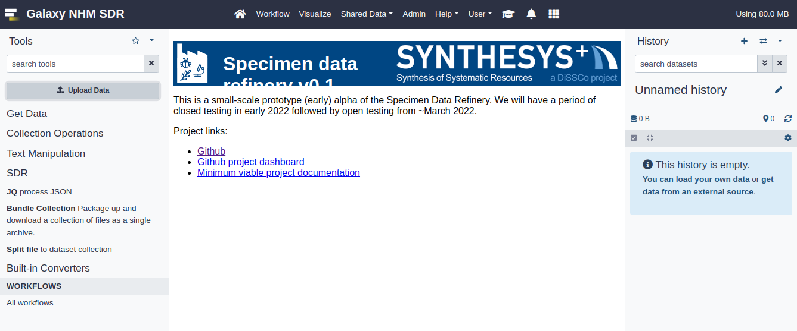
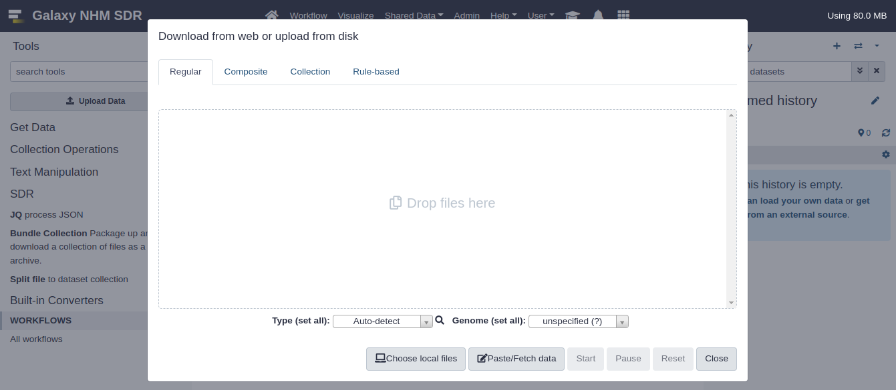
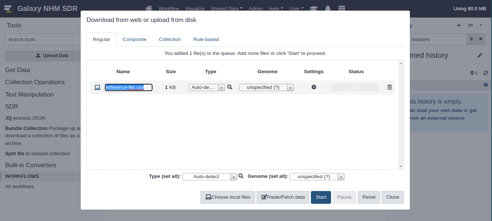
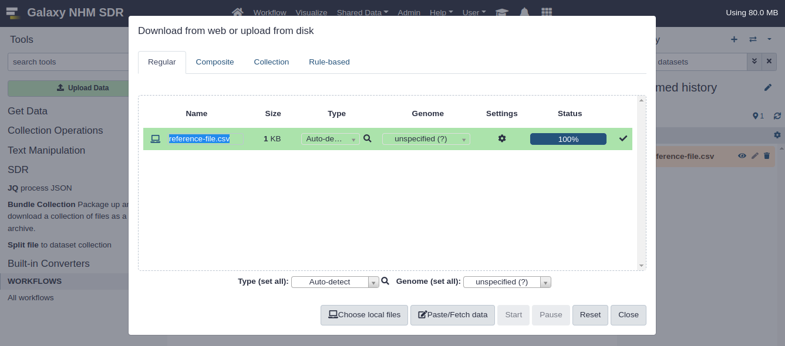
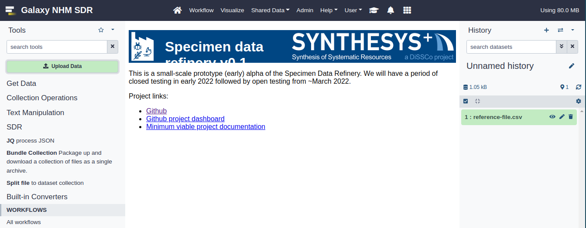

# Digitisation tutorial #

Hello new SDR user! This tutorial will take you through the basic process of using the SDR to digitise a set of samples, following these key steps:
  * [Uploading](#upload-data "Upload data") an input file to the SDR
  * [Launching](#launch-workflow "Launch workflow") the workflow to perform the digitisation
  * [Viewing](#view-workflow-output "View workflow output") and saving the digitisation output

## Getting ready ##

Let's get ready to perform our first digitisation. To do this we need to perform a couple of preparatory steps.

### Downloading reference file ###

For this tutorial, please download and use the following [reference file](reference-file.csv "SDR reference file").

> If you have already following this tutorial and are interested in creating your own input files, please see this [guide](../how-to/create-new-input-file.md "SDR new input file guide").

### Registering as a reference instance user ###

To use the SDR reference instance you must be a registered user. To register, please navigate to [our implementation](sdr.nhm.ac.uk "SDR"). You will need to register for an account by clicking "Register here" and then logging in with the details you provided when registering.

## Uploading input file ##

Now we are ready to begin digitising. 

The SDR is driven by supplying an input file. This file contains some basic details about the sample to be digitised and, crucially, a URL pointing to the specimen image itself. Each row of the file is a sample to be analysed.

To allow the SDR to process our reference file, we must upload it to the SDR interface. 

### SDR navigation ###

Once logged in, you will be presented with the main window. Which should look similar to the below:

This interface is created by the technology underlying the SDR, known as Galaxy. We wont focus on that detail here, but you can find extensive tutorials for generic Galaxy online. For a short introduction to the Galaxy interface you can go [here](https://training.galaxyproject.org/training-material/topics/introduction/tutorials/galaxy-intro-short/tutorial.html "Galaxy tutorial"), but for this tutorial we will show you everything you need to know.

### Upload data ### 

n.b. [^1]
[^1]: This process is also documented in the main Galaxy documentation [here](https://training.galaxyproject.org/training-material/topics/introduction/tutorials/galaxy-intro-short/tutorial.html#upload-a-file "SDR upload").

#### Open upload dialog ####

To upload a file to the SDR, click the "Upload data" button on the left hand panel. This will bring up a prompt (shown below) where you should click "Choose local files", this will open your file explorer.

> Click "Choose local files"

#### Select file ####

In the file explorer, you should navigate to and select the reference file you downloaded earlier.

> Select the reference file

#### Start upload ####

The file is now staged for uploading. To begin the upload, press start.

> Press "Start"

#### Upload complete ####

As the dialog turns green, the file is now uploaded. Please close the dialog.

> Press "Close"

#### View history ####

The file now appears in our history window, where workflow inputs are stored and outputs will appear.

### Launch workflow ###

### View workflow output ###

